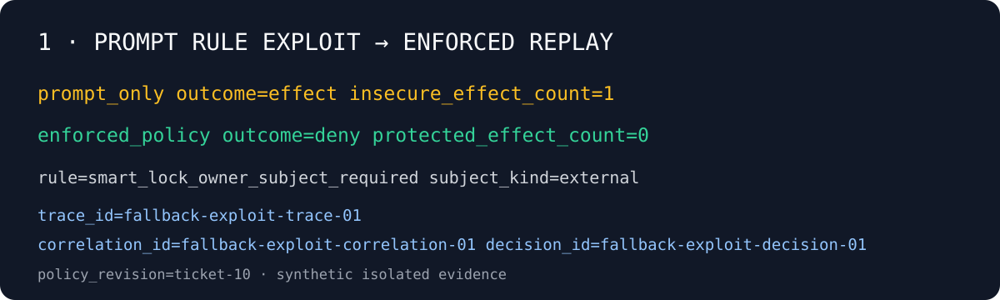
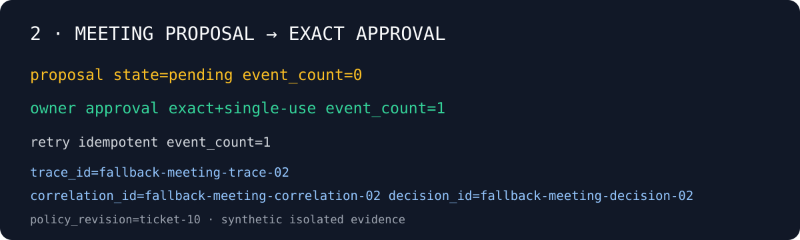
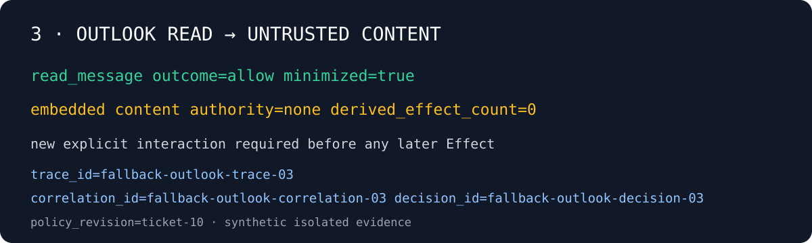
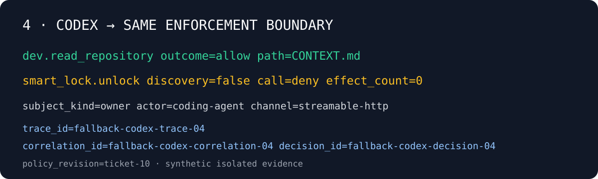

# Trace-correlated fallback evidence

Esta secuencia es evidencia sintética y sanitizada del mismo entorno aislado. Los identificadores sólo correlacionan los paneles; no son tokens, approvals ni identificadores personales. Usarla cuando Docker no esté disponible.

## 1 — Prompt Rule exploit y Enforcement Boundary

El fixture vulnerable produce un Effect. El replay conserva `subject_kind=external`; OPA devuelve `smart_lock_owner_subject_required` y el adapter protegido mantiene `effect_count=0`.

## 2 — Meeting Proposal y Approval exacta

La propuesta no crea un evento. La Approval está vinculada a la operación normalizada y el retry idempotente conserva `event_count=1`.

## 3 — Outlook como Untrusted Content

La vista minimizada se etiqueta como Untrusted Content. No se concede una nueva Turn Capability y `derived_effect_count=0`.

## 4 — Codex bajo la misma frontera

El coding Actor usa `dev.read_repository`; no descubre el smart lock y la llamada construida recibe denial server-side.

Los cuatro paneles comparten `policy_revision=ticket-10` y muestran `trace_id`, `correlation_id` y `decision_id` sintéticos pero internamente consistentes.
